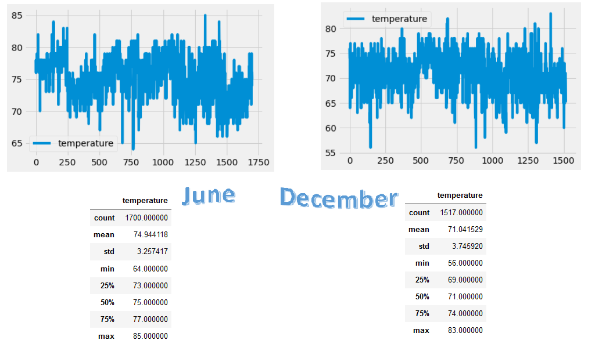

# surfs_up 

# Ready to Surf and Chillax with W.Avy at his ice cream  surf shop???

## Dude, this is going to be cool Pura Vida all year long!

W.Avy asked me to analyze temperatures in Hawaii all year long. I used Python, Pandas functions and SQLAlchemy and focused on the summer month of June and winter in December.
Aloha! Paradise is consistent!

* Overview of *June* in Hawaii Analysis
Of 1700 temperature readings observed in the months of June from 2010 to 2017 
the average temperature is *74.9* degrees Fahrenheit with a standard deviation of 3.3 degrees.

* June Maximum Temp is 85 degrees

* June Mininum Temp is 64 degrees

* Overview of *December* in Hawaii Analysis
Of 1517 temperature readings observed in the months of December from 2010 to 2016 
the average temperature is *71* degrees Fahrenheit with a standard deviation of 3.7 degrees.

* December Maximun Temp is 83 degrees

* December Mininum Temp is 56 degrees

### The differences in mininum observed temperatures offer the greatest range of 8 degrees F.
The average temperatures observed from June to December vary <5 degrees F.
The maximum observed temperatures differ just two degrees from 85 in June to 83 in December. 

